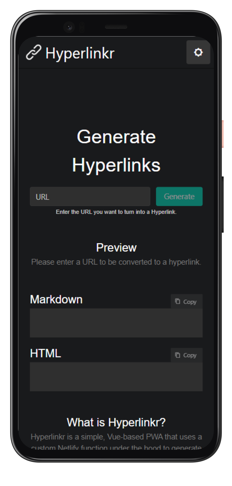

Hyperlinkr is a PWA I built using VueJS to solve a common problem I often had when sharing content on Reddit or GitHub issues, and even in web development. As oftentimes I simply need the hyperlink to display the website's original title, especially on mobile devices it can be quite painful to put together such a hyperlink on the go.

  

Hyperlink uses PWA's `share_target` and clipboard API to make it super easy to paste and copy your links. It outputs in two formats; HTML and markdown and uses a Netlify function to scrape a website's metadata in order to retrieve the title.

You can check out Hyperlinkr [here](http://hyperlinkr.netlify.app/) and install it on your device, it's as simple as that!
